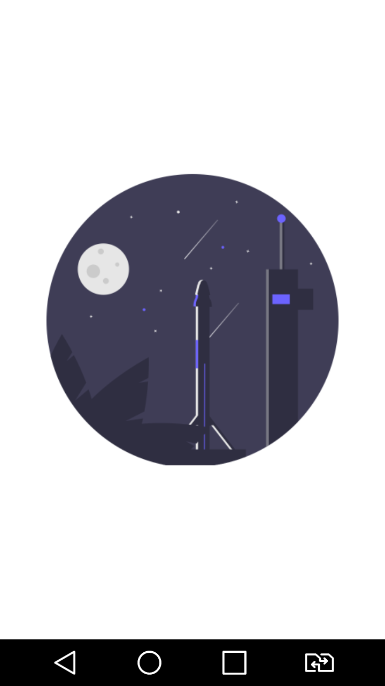
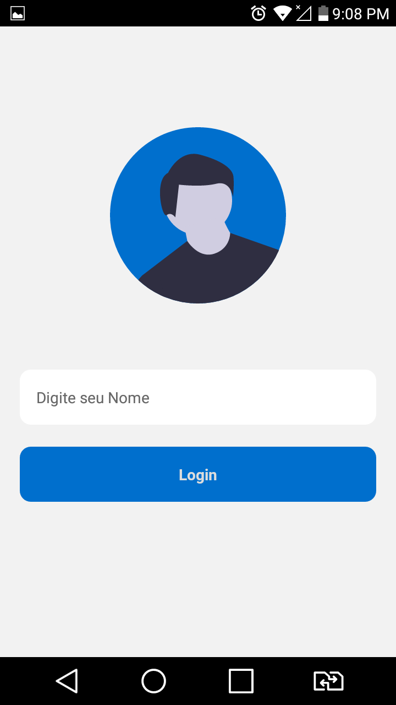
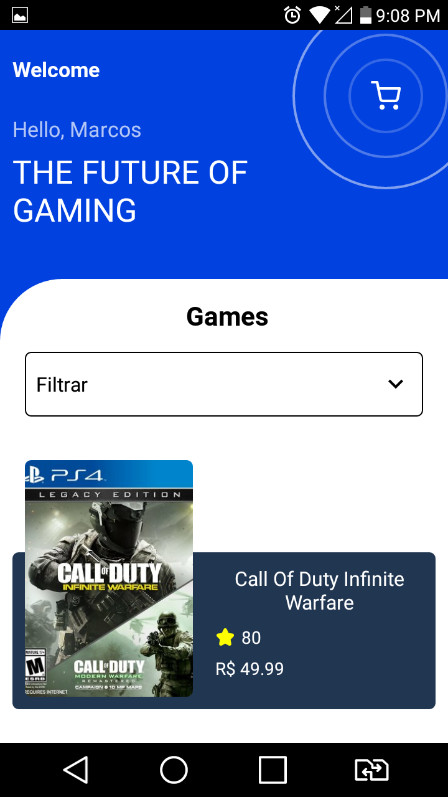
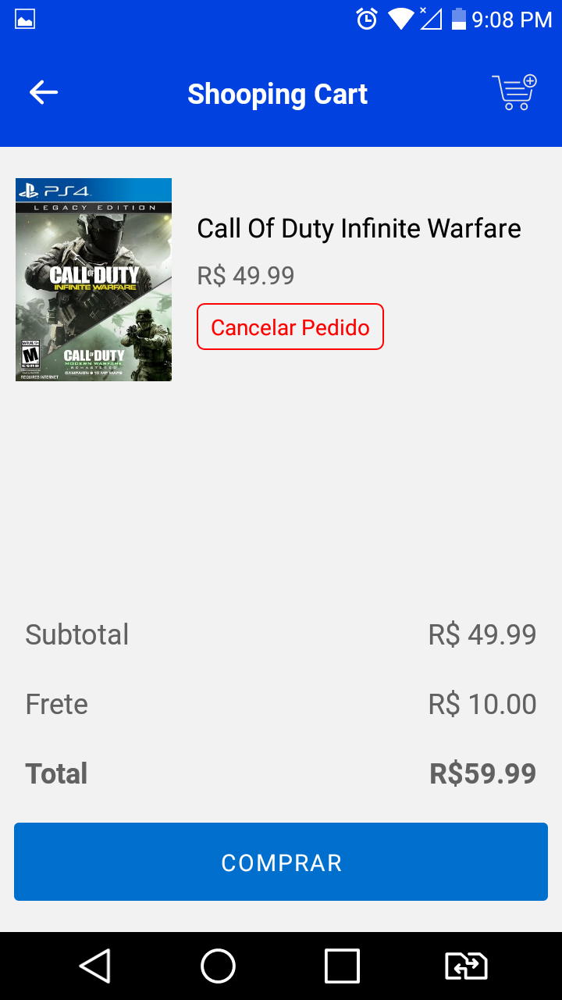

# Supera Inovação em Tecnologia - Desafio

## Tools used

```
- React Native
- React Navigation
- Jest
- Styled-components
```

## Preview







## How run my app

```
1 - Clone from github.
2 - Run yarn install.
3 - Run yarn start.
4 - Connect your device
4 - Enjoy.
```
